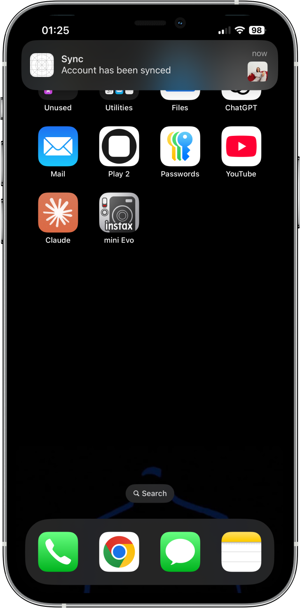
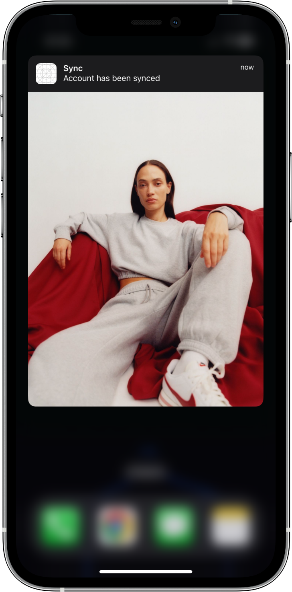
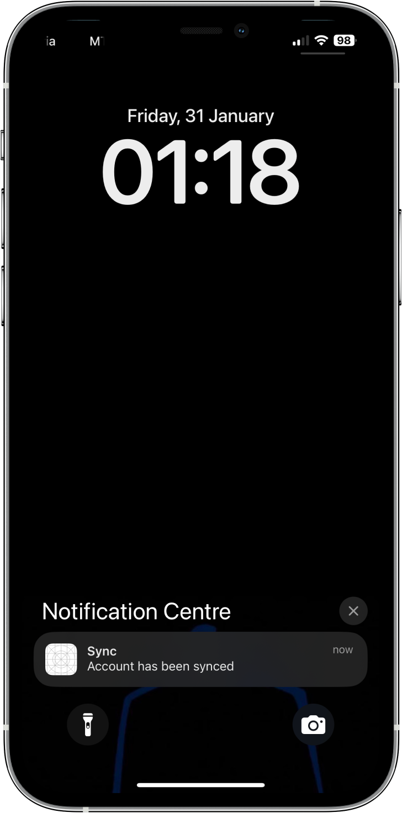

# Push Notifications in SwiftUI

Sending local push notifications based on time, date or location.

<table>
  <tr>
    <td width="33%" style='border: none'>
      
    </td>
    <td width="33%" style='border: none'>
      
    </td>
    <td width="33%" style='border: none'>
      
    </td>
  </tr>
</table>
